<!-- START:hero -->

<picture>
  <source media="(prefers-color-scheme: dark) and (min-width: 1260px)" srcset="assets/hero/hero-dark.svg">
  <source media="(prefers-color-scheme: light) and (min-width: 1260px)" srcset="assets/hero/hero-light.svg">
  <source media="(prefers-color-scheme: dark) and (min-width: 1012px)" srcset="assets/hero/hero-mid-dark.svg">
  <source media="(prefers-color-scheme: light) and (min-width: 1012px)" srcset="assets/hero/hero-mid-light.svg">
  <source media="(prefers-color-scheme: dark)" srcset="assets/hero/hero-mobile-dark.svg">
  <source media="(prefers-color-scheme: light)" srcset="assets/hero/hero-mobile-light.svg">
  
</picture>

<!-- END:hero -->

<!-- START:about -->
I take ambiguous problems and turn them into structured ideas, products and working systems.

I think before I build. I research the domain, challenge the original idea, and define what the product should actually be. Then I design the architecture, specify it precisely, and lead the implementation. AI agents accelerate the build. I set the direction, review everything they produce, audit it adversarially, and make the final engineering and product calls.

That method travels. This year it has taken me from evidence-intelligence infrastructure for legal investigations, with OCR, transcription and vector retrieval over PostgreSQL and pgvector served to AI through MCP on Google Cloud, to interactive websites for businesses, a booking platform, a hardware product concept taken through adversarial validation, and the automation and creative systems in between.

The domains change. The method doesn't.

Currently an AI Specialist, building evidence-intelligence infrastructure.
<!-- END:about -->

<!-- START:links -->
<!-- END:links -->

<!-- START:motion -->

<picture>
  <source media="(prefers-color-scheme: dark) and (min-width: 1260px)" srcset="assets/labels/motion-dark.svg">
  <source media="(prefers-color-scheme: light) and (min-width: 1260px)" srcset="assets/labels/motion-light.svg">
  <source media="(prefers-color-scheme: dark)" srcset="assets/labels/motion-mobile-dark.svg">
  <source media="(prefers-color-scheme: light)" srcset="assets/labels/motion-mobile-light.svg">
  
</picture>

## In motion

<picture>
  <source media="(prefers-color-scheme: dark) and (min-width: 1260px)" srcset="assets/motion/01-dark.svg">
  <source media="(prefers-color-scheme: light) and (min-width: 1260px)" srcset="assets/motion/01-light.svg">
  <source media="(prefers-color-scheme: dark) and (min-width: 1012px)" srcset="assets/motion/01-mid-dark.svg">
  <source media="(prefers-color-scheme: light) and (min-width: 1012px)" srcset="assets/motion/01-mid-light.svg">
  <source media="(prefers-color-scheme: dark)" srcset="assets/motion/01-mobile-dark.svg">
  <source media="(prefers-color-scheme: light)" srcset="assets/motion/01-mobile-light.svg">
  
</picture>
<picture>
  <source media="(prefers-color-scheme: dark) and (min-width: 1260px)" srcset="assets/motion/02-dark.svg">
  <source media="(prefers-color-scheme: light) and (min-width: 1260px)" srcset="assets/motion/02-light.svg">
  <source media="(prefers-color-scheme: dark) and (min-width: 1012px)" srcset="assets/motion/02-mid-dark.svg">
  <source media="(prefers-color-scheme: light) and (min-width: 1012px)" srcset="assets/motion/02-mid-light.svg">
  <source media="(prefers-color-scheme: dark)" srcset="assets/motion/02-mobile-dark.svg">
  <source media="(prefers-color-scheme: light)" srcset="assets/motion/02-mobile-light.svg">
  
</picture>
<a href="https://rumergroups.com"><picture>
  <source media="(prefers-color-scheme: dark) and (min-width: 1260px)" srcset="assets/motion/03-dark.svg">
  <source media="(prefers-color-scheme: light) and (min-width: 1260px)" srcset="assets/motion/03-light.svg">
  <source media="(prefers-color-scheme: dark) and (min-width: 1012px)" srcset="assets/motion/03-mid-dark.svg">
  <source media="(prefers-color-scheme: light) and (min-width: 1012px)" srcset="assets/motion/03-mid-light.svg">
  <source media="(prefers-color-scheme: dark)" srcset="assets/motion/03-mobile-dark.svg">
  <source media="(prefers-color-scheme: light)" srcset="assets/motion/03-mobile-light.svg">
  
</picture></a>
<picture>
  <source media="(prefers-color-scheme: dark) and (min-width: 1260px)" srcset="assets/motion/04-dark.svg">
  <source media="(prefers-color-scheme: light) and (min-width: 1260px)" srcset="assets/motion/04-light.svg">
  <source media="(prefers-color-scheme: dark) and (min-width: 1012px)" srcset="assets/motion/04-mid-dark.svg">
  <source media="(prefers-color-scheme: light) and (min-width: 1012px)" srcset="assets/motion/04-mid-light.svg">
  <source media="(prefers-color-scheme: dark)" srcset="assets/motion/04-mobile-dark.svg">
  <source media="(prefers-color-scheme: light)" srcset="assets/motion/04-mobile-light.svg">
  
</picture>

<!-- END:motion -->

<!-- START:work -->
<!-- END:work -->

<!-- START:stack -->

<picture>
  <source media="(prefers-color-scheme: dark) and (min-width: 1260px)" srcset="assets/labels/stack-dark.svg">
  <source media="(prefers-color-scheme: light) and (min-width: 1260px)" srcset="assets/labels/stack-light.svg">
  <source media="(prefers-color-scheme: dark)" srcset="assets/labels/stack-mobile-dark.svg">
  <source media="(prefers-color-scheme: light)" srcset="assets/labels/stack-mobile-light.svg">
  
</picture>

## Stack & range

<picture>
  <source media="(prefers-color-scheme: dark) and (min-width: 1260px)" srcset="assets/stack/stack-dark.svg">
  <source media="(prefers-color-scheme: light) and (min-width: 1260px)" srcset="assets/stack/stack-light.svg">
  <source media="(prefers-color-scheme: dark) and (min-width: 1012px)" srcset="assets/stack/stack-mid-dark.svg">
  <source media="(prefers-color-scheme: light) and (min-width: 1012px)" srcset="assets/stack/stack-mid-light.svg">
  <source media="(prefers-color-scheme: dark)" srcset="assets/stack/stack-mobile-dark.svg">
  <source media="(prefers-color-scheme: light)" srcset="assets/stack/stack-mobile-light.svg">
  
</picture>

<!-- END:stack -->

<!-- START:signal -->
<!-- END:signal -->

<!-- START:principles -->

<picture>
  <source media="(prefers-color-scheme: dark) and (min-width: 1260px)" srcset="assets/labels/principles-dark.svg">
  <source media="(prefers-color-scheme: light) and (min-width: 1260px)" srcset="assets/labels/principles-light.svg">
  <source media="(prefers-color-scheme: dark)" srcset="assets/labels/principles-mobile-dark.svg">
  <source media="(prefers-color-scheme: light)" srcset="assets/labels/principles-mobile-light.svg">
  
</picture>

## How I work

<picture>
  <source media="(prefers-color-scheme: dark) and (min-width: 1260px)" srcset="assets/method/method-dark.svg">
  <source media="(prefers-color-scheme: light) and (min-width: 1260px)" srcset="assets/method/method-light.svg">
  <source media="(prefers-color-scheme: dark) and (min-width: 1012px)" srcset="assets/method/method-mid-dark.svg">
  <source media="(prefers-color-scheme: light) and (min-width: 1012px)" srcset="assets/method/method-mid-light.svg">
  <source media="(prefers-color-scheme: dark)" srcset="assets/method/method-mobile-dark.svg">
  <source media="(prefers-color-scheme: light)" srcset="assets/method/method-mobile-light.svg">
  
</picture>

1. **Frame** — Break the problem down until the real one is visible.
2. **Research** — Learn the domain before designing for it.
3. **Challenge** — Should this exist? Where does the idea fail? What is the smallest version that proves it?
4. **Specify** — Write the product down precisely enough that nothing is left to interpretation.
5. **Architect** — Data model, infrastructure and boundaries decided before code.
6. **Orchestrate** — Direct AI agents as a force multiplier: scoped, parallel, and reviewed before anything is accepted.
7. **Audit** — Read the output as an adversary. Severity-ranked, checked against the spec, never taken on trust.
8. **Ship &amp; iterate** — Deploy, observe, and feed what breaks back into the spec.

Evidence over assertion. If a claim cannot be verified, it does not ship.

[This profile is built with the same method: specification, truth-gated build, automated checks.](https://github.com/hunainx/hunainx)
<!-- END:principles -->

<!-- START:footer -->

<picture>
  <source media="(prefers-color-scheme: dark) and (min-width: 1260px)" srcset="assets/dividers/rule-dark.svg">
  <source media="(prefers-color-scheme: light) and (min-width: 1260px)" srcset="assets/dividers/rule-light.svg">
  <source media="(prefers-color-scheme: dark) and (min-width: 1012px)" srcset="assets/dividers/rule-mid-dark.svg">
  <source media="(prefers-color-scheme: light) and (min-width: 1012px)" srcset="assets/dividers/rule-mid-light.svg">
  <source media="(prefers-color-scheme: dark)" srcset="assets/dividers/rule-mobile-dark.svg">
  <source media="(prefers-color-scheme: light)" srcset="assets/dividers/rule-mobile-light.svg">
  
</picture>

<picture>
  <source media="(prefers-color-scheme: dark)" srcset="assets/footer/footer-dark.svg">
  
</picture>
 
<a href="https://github.com/hunainx/hunainx/actions/workflows/refresh.yml">refresh workflow</a>

<!-- END:footer -->
