<!-- START:hero -->

<picture>
  <source media="(prefers-color-scheme: dark) and (min-width: 1012px)" srcset="assets/hero/hero-dark.svg">
  <source media="(prefers-color-scheme: light) and (min-width: 1012px)" srcset="assets/hero/hero-light.svg">
  <source media="(prefers-color-scheme: dark)" srcset="assets/hero/hero-mobile-dark.svg">
  <source media="(prefers-color-scheme: light)" srcset="assets/hero/hero-mobile-light.svg">
  
</picture>

<!-- END:hero -->

<!-- START:now -->

<picture>
  <source media="(prefers-color-scheme: dark) and (min-width: 1012px)" srcset="assets/panels/now-dark.svg">
  <source media="(prefers-color-scheme: light) and (min-width: 1012px)" srcset="assets/panels/now-light.svg">
  <source media="(prefers-color-scheme: dark)" srcset="assets/panels/now-mobile-dark.svg">
  <source media="(prefers-color-scheme: light)" srcset="assets/panels/now-mobile-light.svg">
  
</picture>

<!-- END:now -->

<!-- START:about -->

I design and build software end to end: web and mobile apps, games, SaaS platforms and bespoke systems for businesses. My practice is AI-native. Every product begins as a precise written specification, is built with AI coding agents under close direction, and passes an adversarial audit before it ships. The result is software delivered quickly and built to last. I'm based in Mysuru, India, and also work across brand and digital growth.

<!-- END:about -->

<!-- START:links -->
<!-- END:links -->

<!-- START:work -->
<!-- END:work -->

<!-- START:toolkit -->

## Toolkit

<table>
  <tr><th align="left">AI engineering</th><td>Claude Code · Google Antigravity</td></tr>
  <tr><th align="left">Data</th><td>Supabase · Postgres · Google Cloud Storage</td></tr>
  <tr><th align="left">Interactive web</th><td>GSAP + ScrollTrigger · WebGL2</td></tr>
  <tr><th align="left">Delivery</th><td>GitHub · Netlify</td></tr>
</table>

<!-- END:toolkit -->

<!-- START:signal -->
<!-- END:signal -->

<!-- START:principles -->

## How I work

Specification before code. A precise spec is the fastest route to a correct product.

Audit like an adversary. Every finding is ranked by severity, and fixes follow priority, not convenience.

Evidence over assertion. If a claim cannot be verified, it does not ship.

<!-- END:principles -->

<!-- START:footer -->

<picture>
  <source media="(prefers-color-scheme: dark)" srcset="assets/dividers/rule-dark.svg">
  
</picture>
 
<a href="https://github.com/hunainx/hunainx/actions/workflows/refresh.yml">Auto-updated · 2026-09-26</a>

<!-- END:footer -->
