<!-- START:hero -->

<picture>
  <source media="(prefers-color-scheme: dark) and (min-width: 1260px)" srcset="assets/hero/hero-dark.svg">
  <source media="(prefers-color-scheme: light) and (min-width: 1260px)" srcset="assets/hero/hero-light.svg">
  <source media="(prefers-color-scheme: dark) and (min-width: 1012px)" srcset="assets/hero/hero-mid-dark.svg">
  <source media="(prefers-color-scheme: light) and (min-width: 1012px)" srcset="assets/hero/hero-mid-light.svg">
  <source media="(prefers-color-scheme: dark)" srcset="assets/hero/hero-mobile-dark.svg">
  <source media="(prefers-color-scheme: light)" srcset="assets/hero/hero-mobile-light.svg">
  
</picture>

<!-- END:hero -->

<!-- START:about -->
I turn ambiguous problems into structured, working systems.

Most of my work happens before the first line of code: breaking the problem down, researching the domain, and stress-testing whether the idea should be built at all. What survives becomes a precise specification and an architecture. AI coding agents carry the implementation under close direction, and everything they produce is audited adversarially before it ships.

Right now that means evidence-intelligence infrastructure: pipelines that turn large, unstructured archives of documents, email, attachments and voice recordings into searchable evidence through OCR, transcription and vector retrieval, exposed to AI through MCP servers on Google Cloud. Alongside it are production web products, product concepts taken through adversarial validation, and the brand and creative systems around them.

The domains change. The method doesn't.
<!-- END:about -->

<!-- START:links -->
<!-- END:links -->

<!-- START:building -->

<picture>
  <source media="(prefers-color-scheme: dark) and (min-width: 1260px)" srcset="assets/labels/building-dark.svg">
  <source media="(prefers-color-scheme: light) and (min-width: 1260px)" srcset="assets/labels/building-light.svg">
  <source media="(prefers-color-scheme: dark)" srcset="assets/labels/building-mobile-dark.svg">
  <source media="(prefers-color-scheme: light)" srcset="assets/labels/building-mobile-light.svg">
  
</picture>

## Currently building

<picture>
  <source media="(prefers-color-scheme: dark) and (min-width: 1260px)" srcset="assets/building/01-dark.svg">
  <source media="(prefers-color-scheme: light) and (min-width: 1260px)" srcset="assets/building/01-light.svg">
  <source media="(prefers-color-scheme: dark) and (min-width: 1012px)" srcset="assets/building/01-mid-dark.svg">
  <source media="(prefers-color-scheme: light) and (min-width: 1012px)" srcset="assets/building/01-mid-light.svg">
  <source media="(prefers-color-scheme: dark)" srcset="assets/building/01-mobile-dark.svg">
  <source media="(prefers-color-scheme: light)" srcset="assets/building/01-mobile-light.svg">
  
</picture>
<picture>
  <source media="(prefers-color-scheme: dark) and (min-width: 1260px)" srcset="assets/building/02-dark.svg">
  <source media="(prefers-color-scheme: light) and (min-width: 1260px)" srcset="assets/building/02-light.svg">
  <source media="(prefers-color-scheme: dark) and (min-width: 1012px)" srcset="assets/building/02-mid-dark.svg">
  <source media="(prefers-color-scheme: light) and (min-width: 1012px)" srcset="assets/building/02-mid-light.svg">
  <source media="(prefers-color-scheme: dark)" srcset="assets/building/02-mobile-dark.svg">
  <source media="(prefers-color-scheme: light)" srcset="assets/building/02-mobile-light.svg">
  
</picture>
<picture>
  <source media="(prefers-color-scheme: dark) and (min-width: 1260px)" srcset="assets/building/03-dark.svg">
  <source media="(prefers-color-scheme: light) and (min-width: 1260px)" srcset="assets/building/03-light.svg">
  <source media="(prefers-color-scheme: dark) and (min-width: 1012px)" srcset="assets/building/03-mid-dark.svg">
  <source media="(prefers-color-scheme: light) and (min-width: 1012px)" srcset="assets/building/03-mid-light.svg">
  <source media="(prefers-color-scheme: dark)" srcset="assets/building/03-mobile-dark.svg">
  <source media="(prefers-color-scheme: light)" srcset="assets/building/03-mobile-light.svg">
  
</picture>
<a href="https://github.com/hunainx/hunainx"><picture>
  <source media="(prefers-color-scheme: dark) and (min-width: 1260px)" srcset="assets/building/04-dark.svg">
  <source media="(prefers-color-scheme: light) and (min-width: 1260px)" srcset="assets/building/04-light.svg">
  <source media="(prefers-color-scheme: dark) and (min-width: 1012px)" srcset="assets/building/04-mid-dark.svg">
  <source media="(prefers-color-scheme: light) and (min-width: 1012px)" srcset="assets/building/04-mid-light.svg">
  <source media="(prefers-color-scheme: dark)" srcset="assets/building/04-mobile-dark.svg">
  <source media="(prefers-color-scheme: light)" srcset="assets/building/04-mobile-light.svg">
  
</picture></a>

<!-- END:building -->

<!-- START:clients -->

<picture>
  <source media="(prefers-color-scheme: dark) and (min-width: 1260px)" srcset="assets/labels/clients-dark.svg">
  <source media="(prefers-color-scheme: light) and (min-width: 1260px)" srcset="assets/labels/clients-light.svg">
  <source media="(prefers-color-scheme: dark)" srcset="assets/labels/clients-mobile-dark.svg">
  <source media="(prefers-color-scheme: light)" srcset="assets/labels/clients-mobile-light.svg">
  
</picture>

## Client work

<a href="https://rumergroups.com"><picture>
  <source media="(prefers-color-scheme: dark) and (min-width: 1260px)" srcset="assets/clients/rumer-groups-dark.svg">
  <source media="(prefers-color-scheme: light) and (min-width: 1260px)" srcset="assets/clients/rumer-groups-light.svg">
  <source media="(prefers-color-scheme: dark) and (min-width: 1012px)" srcset="assets/clients/rumer-groups-mid-dark.svg">
  <source media="(prefers-color-scheme: light) and (min-width: 1012px)" srcset="assets/clients/rumer-groups-mid-light.svg">
  <source media="(prefers-color-scheme: dark)" srcset="assets/clients/rumer-groups-mobile-dark.svg">
  <source media="(prefers-color-scheme: light)" srcset="assets/clients/rumer-groups-mobile-light.svg">
  
</picture></a>
<picture>
  <source media="(prefers-color-scheme: dark) and (min-width: 1260px)" srcset="assets/clients/airo-rentals-dark.svg">
  <source media="(prefers-color-scheme: light) and (min-width: 1260px)" srcset="assets/clients/airo-rentals-light.svg">
  <source media="(prefers-color-scheme: dark) and (min-width: 1012px)" srcset="assets/clients/airo-rentals-mid-dark.svg">
  <source media="(prefers-color-scheme: light) and (min-width: 1012px)" srcset="assets/clients/airo-rentals-mid-light.svg">
  <source media="(prefers-color-scheme: dark)" srcset="assets/clients/airo-rentals-mobile-dark.svg">
  <source media="(prefers-color-scheme: light)" srcset="assets/clients/airo-rentals-mobile-light.svg">
  
</picture>

<!-- END:clients -->

<!-- START:work -->
<!-- END:work -->

<!-- START:stack -->

<picture>
  <source media="(prefers-color-scheme: dark) and (min-width: 1260px)" srcset="assets/labels/stack-dark.svg">
  <source media="(prefers-color-scheme: light) and (min-width: 1260px)" srcset="assets/labels/stack-light.svg">
  <source media="(prefers-color-scheme: dark)" srcset="assets/labels/stack-mobile-dark.svg">
  <source media="(prefers-color-scheme: light)" srcset="assets/labels/stack-mobile-light.svg">
  
</picture>

## Stack

<picture>
  <source media="(prefers-color-scheme: dark) and (min-width: 1260px)" srcset="assets/stack/stack-dark.svg">
  <source media="(prefers-color-scheme: light) and (min-width: 1260px)" srcset="assets/stack/stack-light.svg">
  <source media="(prefers-color-scheme: dark) and (min-width: 1012px)" srcset="assets/stack/stack-mid-dark.svg">
  <source media="(prefers-color-scheme: light) and (min-width: 1012px)" srcset="assets/stack/stack-mid-light.svg">
  <source media="(prefers-color-scheme: dark)" srcset="assets/stack/stack-mobile-dark.svg">
  <source media="(prefers-color-scheme: light)" srcset="assets/stack/stack-mobile-light.svg">
  
</picture>

<!-- END:stack -->

<!-- START:activity -->

<picture>
  <source media="(prefers-color-scheme: dark) and (min-width: 1260px)" srcset="assets/labels/activity-dark.svg">
  <source media="(prefers-color-scheme: light) and (min-width: 1260px)" srcset="assets/labels/activity-light.svg">
  <source media="(prefers-color-scheme: dark)" srcset="assets/labels/activity-mobile-dark.svg">
  <source media="(prefers-color-scheme: light)" srcset="assets/labels/activity-mobile-light.svg">
  
</picture>

## Activity

<picture>
  <source media="(prefers-color-scheme: dark) and (min-width: 1260px)" srcset="assets/activity/activity-dark.svg">
  <source media="(prefers-color-scheme: light) and (min-width: 1260px)" srcset="assets/activity/activity-light.svg">
  <source media="(prefers-color-scheme: dark) and (min-width: 1012px)" srcset="assets/activity/activity-mid-dark.svg">
  <source media="(prefers-color-scheme: light) and (min-width: 1012px)" srcset="assets/activity/activity-mid-light.svg">
  <source media="(prefers-color-scheme: dark)" srcset="assets/activity/activity-mobile-dark.svg">
  <source media="(prefers-color-scheme: light)" srcset="assets/activity/activity-mobile-light.svg">
  
</picture>

<!-- END:activity -->

<!-- START:principles -->

<picture>
  <source media="(prefers-color-scheme: dark) and (min-width: 1260px)" srcset="assets/labels/principles-dark.svg">
  <source media="(prefers-color-scheme: light) and (min-width: 1260px)" srcset="assets/labels/principles-light.svg">
  <source media="(prefers-color-scheme: dark)" srcset="assets/labels/principles-mobile-dark.svg">
  <source media="(prefers-color-scheme: light)" srcset="assets/labels/principles-mobile-light.svg">
  
</picture>

## How I work

<picture>
  <source media="(prefers-color-scheme: dark) and (min-width: 1260px)" srcset="assets/method/method-dark.svg">
  <source media="(prefers-color-scheme: light) and (min-width: 1260px)" srcset="assets/method/method-light.svg">
  <source media="(prefers-color-scheme: dark) and (min-width: 1012px)" srcset="assets/method/method-mid-dark.svg">
  <source media="(prefers-color-scheme: light) and (min-width: 1012px)" srcset="assets/method/method-mid-light.svg">
  <source media="(prefers-color-scheme: dark)" srcset="assets/method/method-mobile-dark.svg">
  <source media="(prefers-color-scheme: light)" srcset="assets/method/method-mobile-light.svg">
  
</picture>

1. **Frame** — Break the problem down until the real one is visible.
2. **Research** — Learn the domain before designing for it.
3. **Challenge** — Should this exist? Where does the idea fail? What is the smallest version that proves it?
4. **Specify** — Write the product down precisely enough that an agent can't misread it.
5. **Architect** — Data model, infrastructure and boundaries decided before code.
6. **Orchestrate** — AI agents as the build team: scoped, parallel, supervised.
7. **Audit** — Read the output as an adversary. Severity-ranked, checked against the spec, never taken on trust.
8. **Ship &amp; iterate** — Deploy, observe, and feed what breaks back into the spec.

Evidence over assertion. If a claim cannot be verified, it does not ship.
<!-- END:principles -->

<!-- START:footer -->

<picture>
  <source media="(prefers-color-scheme: dark) and (min-width: 1260px)" srcset="assets/dividers/rule-dark.svg">
  <source media="(prefers-color-scheme: light) and (min-width: 1260px)" srcset="assets/dividers/rule-light.svg">
  <source media="(prefers-color-scheme: dark) and (min-width: 1012px)" srcset="assets/dividers/rule-mid-dark.svg">
  <source media="(prefers-color-scheme: light) and (min-width: 1012px)" srcset="assets/dividers/rule-mid-light.svg">
  <source media="(prefers-color-scheme: dark)" srcset="assets/dividers/rule-mobile-dark.svg">
  <source media="(prefers-color-scheme: light)" srcset="assets/dividers/rule-mobile-light.svg">
  
</picture>

<picture>
  <source media="(prefers-color-scheme: dark)" srcset="assets/footer/footer-dark.svg">
  
</picture>
 
<a href="https://github.com/hunainx/hunainx/actions/workflows/refresh.yml">refresh workflow</a>

<!-- END:footer -->
